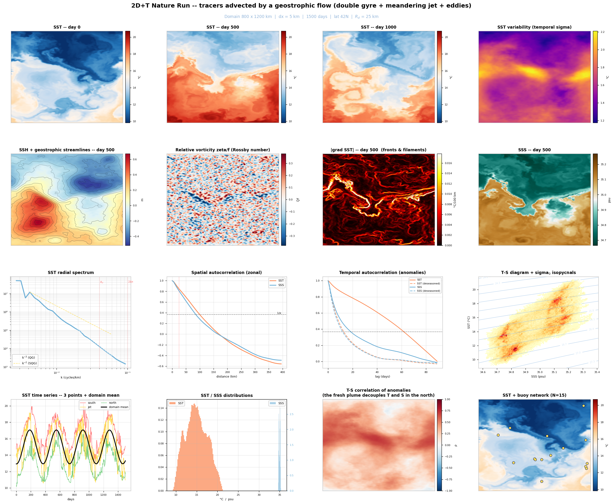
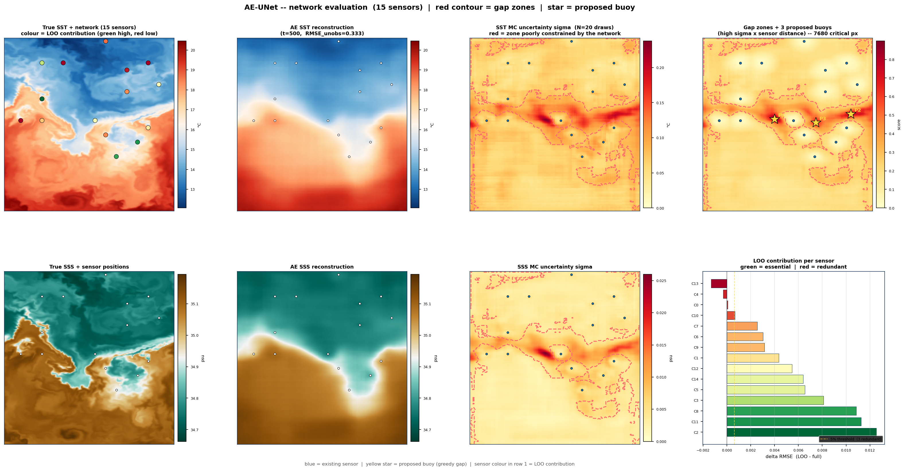
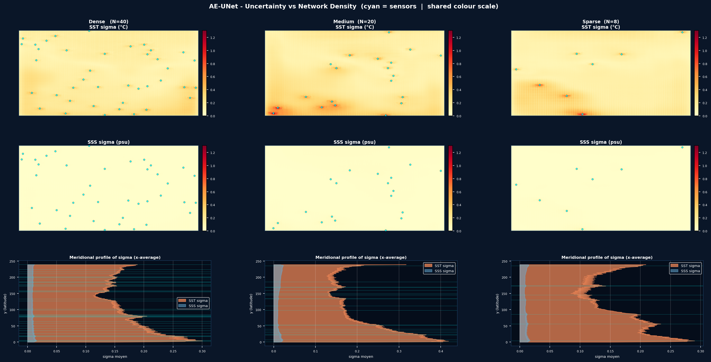
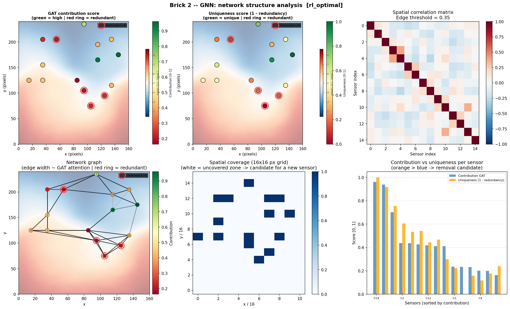
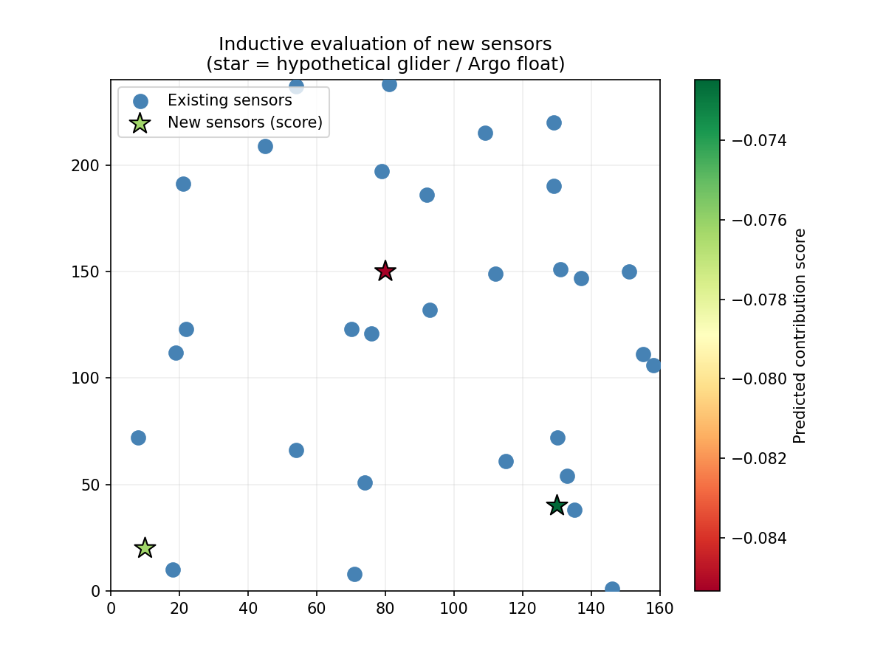
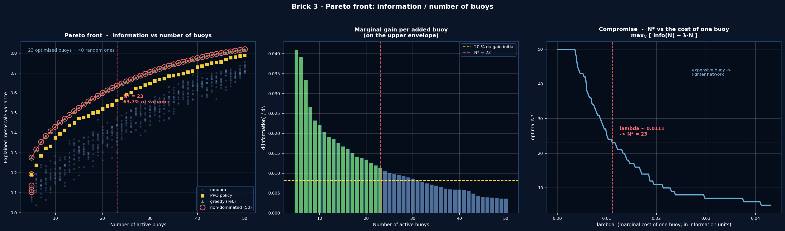
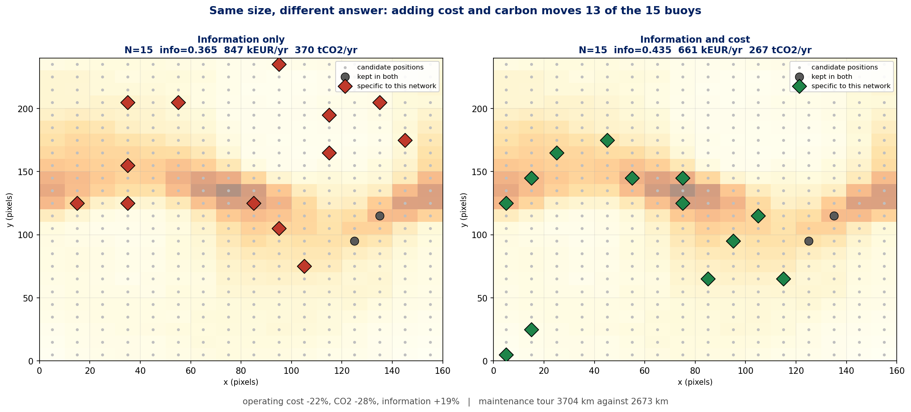
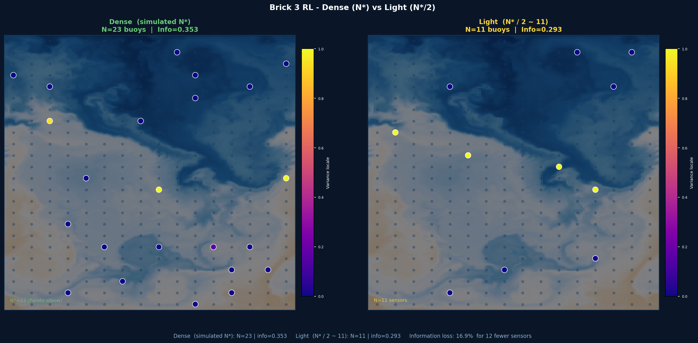

# NAIADE

**Optimal Experimental Design for marine observing networks, with AI.**

> This README was written with the help of an AI assistant, then reviewed and
> corrected by the author. The code, the results and the scientific choices are
> the author's.

Where should you put ocean sensors? NAIADE answers that as an OSSE: a synthetic
ocean plays the role of ground truth, so any network can be scored against a
known answer.

Three components share the same ocean and the same scoring rule, so their
answers can be compared. Each also runs on its own.

| | asks | answers with |
|---|---|---|
| **Autoencoder** `01_autoencoder.py` | where is the network blind? | reconstruction error, uncertainty, gap map |
| **Graph network** `02_gnn.py` | which sensors are redundant? | attention weights, inductive scoring |
| **Reinforcement learning** `03_rl.py` | how many, where, at what cost? | Pareto fronts under constraints |

The files are numbered in the order they were written, not in the order they
run. **The pipeline runs RL first**, then the GNN, then the autoencoder, so
every diagnostic describes the same network.

This is a proof of concept: the ocean is synthetic and there is no data
assimilation in the loop. See [Limitations](#limitations).

---

## 1. Install

```bash
git clone https://github.com/Jvient/NAIADE
cd NAIADE
pip install -r requirements.txt
```

PyTorch Geometric is optional; without it the graph network falls back to a
hand-written attention layer. `torch` itself is optional for the ocean
generator, which is pure numpy.

Runs on CPU, uses a GPU automatically when there is one.

---

## 2. Quick start

**Everything, end to end.** The reference run:

```bash
python run_demo.py --mode pipeline \
  --seed_ocean 42 --seed_buoys 7 --nt 1500 \
  --rl_grid_x 16 --rl_grid_y 24 --rl_n_max 40 --rl_steps 50000 \
  --ae_epochs 200 --ae_base_ch 32 --gnn_epochs 500 \
  --ocean_gif --ocean_gif_var T,GRADT,S --ocean_gif_every 10
```

**A first look**, two minutes instead of several hours:

```bash
python run_demo.py --mode pipeline --nt 90 --rl_steps 400 \
  --ae_epochs 1 --ae_base_ch 8 --gnn_epochs 40
```

**The three components independently**, on the same ocean and the same starting
network, to compare them rather than chain them:

```bash
python run_demo.py --mode individual --nt 1500
```

**One component at a time**, each with its own figures and report:

```bash
python data/dataset.py     --nt 1500 --seed 42 --gif --gif_every 10
python 01_autoencoder.py   --train --figures --score --report --nt 1500
python 02_gnn.py           --train --analyze --inductive --report --nt 1500
python 03_rl.py            --train --pareto --multiobj --report --nt 1500
```

Everything lands in `outputs/`: figures, checkpoints, and a timestamped report
with the parameters and the numbers. Two seeds control everything:
`--seed_ocean` fixes the ocean, `--seed_buoys` the starting array.

What the pipeline does, in order:

```
1.  RL          proposes a network under cost and separation constraints
1b. compare     the same size, with and without cost in the objective
2.  GNN         redundancy, coverage, structure
3.  AE          reconstruction, uncertainty, where to add sensors
3b. GNN         scores the positions the AE just proposed
```

`python run_demo.py --help` lists every flag. The ones you are most likely to
touch:

| flag | default | |
|---|---|---|
| `--nt` | 1000 | days. See §3 on why 1500 rather than 365 |
| `--rl_n_min` / `--rl_n_max` | 5 / 20 | hard bounds on the number of buoys |
| `--rl_grid_x` / `--rl_grid_y` | 16 / 24 | candidate grid |
| `--rl_min_sep` | 2 | minimum separation, in **grid cells**, not km |
| `--n_proposed` | 3 | buoys the AE proposes, and what the GNN then scores |
| `--cost_compare_ref` | greedy | `greedy` isolates the cost term, `rl` compares against the agent |
| `--ocean_gif_var` | T,GRADT,S,GRADS | comma separated; `GRADT` shows the fronts best |

---

## 3. The synthetic ocean



A 2D+T nature run over an 800 × 1200 km channel at 5 km resolution, 42°N: SST,
SSS, SSH, velocities, vorticity and density, in real units.

It is not a sum of patterns painted into a temperature field. A geostrophic
streamfunction (double gyre, meandering jet, mesoscale eddies, unresolved k⁻³
perturbation) advects the tracers semi-Lagrangianly against a restoring towards
climatology. **Fronts and filaments are not drawn, they emerge** from that
competition. Eddies live in the streamfunction, drift westward, and decay.

Diagnostics at seed 42, printed by `data/dataset.py` for your own seed:

| | | |
|---|---|---|
| σ(SST) | 2.60 °C | |
| σ(SSS) | 0.177 psu | 15× smaller, never mix them unstandardised |
| spatial decorrelation | 95 km | reference sensor spacing |
| mesoscale decorrelation | 12 days | reference sampling frequency |
| T–S correlation | +0.77 | |

> **Why `--nt 1500` and not 365.** What matters is not the length but the number
> of independent mesoscale realisations, `nt / 12 days`. One year gives about 30
> of them against `2n` covariance parameters, and the estimate breaks down. 1500
> days gives about 125. Below 365 the seasonal cycle is not even sampled over a
> full period.

---

## The three components

### Autoencoder, where the network is blind



A U-Net reconstructs the full field from the sensors alone. The trick is in the
training: hide all but a handful of pixels and score the guess **on the hidden
pixels only**, so the model cannot win by copying its input. The mask changes at
every step, from 10 to 80 sensors, so one trained model scores any network
without retraining.

MC-Dropout at inference gives a per-pixel uncertainty. The **gap map**, on the
right of the figure, combines that uncertainty with distance to the nearest
sensor and returns candidate positions directly. Its distance term saturates at
the influence radius: past that scale a sensor constrains nothing, so 200 km
away is not twice as good as 90 km, and the corners of the domain stop winning.

The bar chart ranks sensors by leave-one-out contribution. **A negative score
means removing that sensor improves the reconstruction**: it was contributing
redundancy and noise.



*The same network at 40, 20 and 8 observations. This is what turns a number of
buoys into an expected accuracy.*

### Graph network, which sensors are redundant



One node per sensor, one edge wherever two records move together. Attention
weighs the links, and a node whose neighbours already say what it says comes
out redundant.

> **The seasonal cycle is a trap.** Leave it in and 73 % of sensor pairs pass
> the correlation threshold: the graph is a near-clique and redundancy means
> nothing. Remove the domain mean and it drops to 8 %. It is a global mode that
> moves every sensor together and hides exactly the mesoscale structure the
> network exists to sample.



*A GraphSAGE head scores positions that do not exist yet, so a new mooring or
glider line can be evaluated before anything is deployed. It is trained on the
existing network with 20 % of nodes held out, and the held-out MSE is written on
the figure: if it sits close to the target variance, the colours mean nothing.*

### Reinforcement learning, how many and where



A PPO agent toggles candidate positions; the reward is information gained minus
cost. The information criterion is the **explained variance by optimal linear
estimation**, the objective analysis framework of Bretherton, Davis and Fandry
(1976), the same one operational interpolation uses. It is increasing,
saturating and submodular, so diminishing returns are guaranteed and the elbow
is well defined.

Minimum spacing is not encouraged through the reward, it is **enforced**:
illegal positions are removed before the agent chooses.

> **Overfitting is real.** One year of ocean holds ~30 independent realisations
> against 2n = 40 parameters at 20 buoys. The raw sample covariance gives a
> *negative* out-of-sample score. NAIADE shrinks towards a parametric model,
> exactly as operational optimal interpolation does.



*The same number of buoys, optimised on information alone and on information
plus cost. Cost is not proportional to N: at fixed N it varies by a factor 1.3
to 1.6 with how spread out the network is, because of the maintenance tour from
port. That is what makes the two objectives genuinely antagonistic.*



*The same optimiser at two sizes.*

Two warnings from experience:

- **If N★ comes out equal to `--rl_n_max`**, the cap is binding and the elbow is
  your constraint rather than a property of the data. Raise it and look again.
- **`min_sep` counts grid cells, not kilometres.** On a 16 × 24 grid a cell is
  50 km, so `--rl_min_sep 2` is 100 km, matching the 90 km influence radius.
  Double the grid without touching it and buoys start clustering: use
  `--rl_min_sep 4`.

---

## Limitations

**No assimilation in the loop.** Information is measured by optimal linear
estimation, so what is quantified is how reconstructable the analysed field is,
not how much forecast error goes down. Whether one is an acceptable surrogate
for the other is an open question. This is the limitation that matters most.

**One idealised domain.** A mid-latitude channel. Another regime means
recalibrating the eddy statistics, or feeding a real model output through the
same interface.

**Surface only.** SST, SSS, SSH. No vertical structure, no biogeochemistry.

**Cost and carbon figures are indicative orders of magnitude.** They live in
`config.py`, meant to be recalibrated on real logistics. The maintenance tour
uses a nearest-neighbour route, 10 to 25 % above optimal.

**Reproducible on the ocean and the network, not on the training.** The seeds
fix the nature run and the reference array; PyTorch seeds are not fixed, so two
trainings differ slightly.

Numbers quoted in this README come from one run and move with `--nt`, the seed
and the training budget. Regenerate rather than quote.

---

## Layout

```
config.py            all constants, including the cost and carbon model
data/dataset.py      ocean generator, PyTorch datasets, shared helpers
01_autoencoder.py    observability and gap maps
02_gnn.py            redundancy, structure, inductive scoring
03_rl.py             optimisation under constraints
run_demo.py          pipeline and individual entry points
figures/             reference gallery, committed
outputs/             everything a run produces, git-ignored
```

---

## References

**The information criterion and the design framework**

- Bretherton, F. P., Davis, R. E., & Fandry, C. B. (1976). A technique for objective analysis and design of oceanographic experiments applied to MODE-73. *Deep-Sea Research*, 23(7), 559–582.
- Krause, A., Singh, A., & Guestrin, C. (2008). Near-optimal sensor placements in Gaussian processes. *JMLR*, 9, 235–284.
- Nemhauser, G. L., Wolsey, L. A., & Fisher, M. L. (1978). An analysis of approximations for maximizing submodular set functions I. *Mathematical Programming*, 14(1), 265–294.
- Ledoit, O., & Wolf, M. (2004). A well-conditioned estimator for large-dimensional covariance matrices. *JMVA*, 88(2), 365–411.
- Oke, P. R., & Schiller, A. (2007). A model-based assessment and design of a tropical Indian Ocean mooring array. *Journal of Climate*, 20(13), 3269–3283.
- Gasparin, F., et al. (2019). Requirements for an integrated in situ Atlantic Ocean observing system from coordinated OSSEs. *Frontiers in Marine Science*, 6, 83.

**The methods**

- Ronneberger, O., Fischer, P., & Brox, T. (2015). U-Net. *MICCAI*, LNCS 9351, 234–241.
- Gal, Y., & Ghahramani, Z. (2016). Dropout as a Bayesian approximation. *ICML*, PMLR 48, 1050–1059.
- Perez, E., et al. (2018). FiLM: visual reasoning with a general conditioning layer. *AAAI*.
- Veličković, P., et al. (2018). Graph attention networks. *ICLR*.
- Hamilton, W. L., Ying, R., & Leskovec, J. (2017). Inductive representation learning on large graphs. *NeurIPS*, 30.
- Schulman, J., et al. (2017). Proximal policy optimization algorithms. *arXiv:1707.06347*.
- Satopää, V., et al. (2011). Finding a "kneedle" in a haystack. *ICDCS Workshops*.

**The synthetic ocean**

- Charney, J. G. (1971). Geostrophic turbulence. *JAS*, 28(6), 1087–1095.
- Held, I. M., et al. (1995). Surface quasi-geostrophic dynamics. *JFM*, 282, 1–20.
- Chelton, D. B., Schlax, M. G., & Samelson, R. M. (2011). Global observations of nonlinear mesoscale eddies. *Progress in Oceanography*, 91(2), 167–216.
- Staniforth, A., & Côté, J. (1991). Semi-Lagrangian integration schemes for atmospheric models. *MWR*, 119(9), 2206–2223.
- Millero, F. J., & Poisson, A. (1981). International one-atmosphere equation of state of seawater. *Deep-Sea Research A*, 28(6), 625–629.

**Context**

- Racault, M.-F., et al. (2023). Towards sustainable ocean observation: carbon footprint benchmarking. *Frontiers in Marine Science*, 10, 1101993.
- Duffield, S., et al. (2022). Deep reinforcement learning for adaptive ocean observation. *Environmental Data Science*, 1, e13.
- Lam, R., et al. (2023). GraphCast. *Science*, 382(6677), 1416–1421.

A fuller bibliography, and the table mapping each implementation choice to the
work that justifies it, is in [`docs/references.md`](docs/references.md).

---

## Citing

```bibtex
@software{naiade,
  author = {Vient, Jean-Marie},
  title  = {NAIADE: AI methods for Optimal Experimental Design
            of marine observing networks},
  year   = {2026},
  url    = {https://github.com/Jvient/NAIADE}
}
```

Jean-Marie Vient, Shom, Brest. jean-marie.vient@shom.fr
